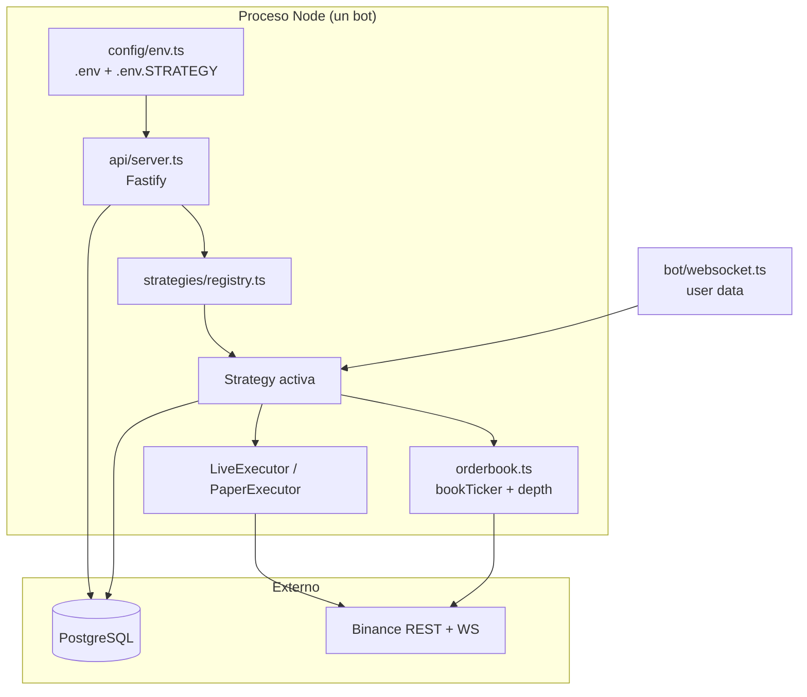

# Referencia para iteración sobre estrategias (contexto para IA)

> **Propósito:** este archivo es la fuente de verdad para que cualquier modelo (Cursor,
> Claude, GPT, etc.) pueda modificar, depurar o extender las estrategias **sin depender
> del historial de chat**. Léelo completo antes de tocar código.
>
> **Especificación detallada de reglas de trading:** [`estrategias-plan-implementacion.md`](./estrategias-plan-implementacion.md)
>
> **Última actualización del estado del repo:** julio 2026 — las 5 estrategias están implementadas.

---

## 1. Qué es este proyecto

Bot **multi-estrategia** para **Binance USDM Futures** (TypeScript/Node.js). Cada
estrategia corre en **un proceso separado** (puerto HTTP distinto), comparte **una
PostgreSQL** y se selecciona con `STRATEGY=<id>`.

| Componente | Ubicación |
|---|---|
| Entry point | `src/api/server.ts` (importa `../config/env` **primero**) |
| Registry | `src/strategies/registry.ts` |
| Interfaz común | `src/strategies/types.ts` → `Strategy` |
| Ladder (bot original) | `src/bot/engine.ts` envuelto en `src/strategies/ladder.ts` |
| Estrategias nuevas | `src/strategies/{momentum,bounce,liqrev,funding}/` |
| Ejecución live/paper | `src/execution/{live,paper,spotPaper}.ts` |
| Persistencia | `bot_state.orders.<strategyId>` (JSONB) + tabla `trades` |
| Tests | `src/bot/__tests__/*.test.ts` — `npm test` |

---

## 2. Arquitectura (flujo de eventos)



**Secuencia típica:**

1. `npm start` → carga env → arranca Fastify + equity snapshots + WS user data.
2. Estrategia hace `init()` (precisión, estado DB, streams).
3. `POST /start` → `stateManager.updateStatus('RUNNING')` → `strategy.start()`.
4. Señales/órdenes → `onOrderUpdate` / `onAlgoUpdate` vía WS.
5. `POST /stop` → cancela órdenes, para timers/streams.

---

## 3. Contrato `Strategy` (obligatorio)

```typescript
// src/strategies/types.ts
interface Strategy {
  readonly id: StrategyId; // 'ladder' | 'funding' | 'momentum' | 'liqrev' | 'bounce'
  init(): Promise<void>;
  start(): Promise<void>;
  stop(): Promise<void>;
  sync(): Promise<void>;
  onOrderUpdate(data: { order: Record<string, unknown> }): Promise<unknown>;
  onAlgoUpdate(data: { algoOrder: Record<string, unknown> }): Promise<unknown>;
  getMetrics(): Promise<Record<string, unknown>>;
}
```

**Registrar nueva estrategia:**

1. Añadir id a `StrategyId` en `types.ts`.
2. Implementar clase en `src/strategies/<nombre>/`.
3. Añadir `case` en `registry.ts` → `buildStrategy()`.
4. Crear `.env.<nombre>.example`.
5. Tests en `src/bot/__tests__/<nombre>*.test.ts`.

---

## 4. Convenciones que NO se pueden romper

### 4.1 Serialización (`runExclusive`)

Todas las estrategias nuevas usan una cadena de promesas para evitar carreras entre
WS handlers y timers:

```typescript
private chain: Promise<unknown> = Promise.resolve();

private runExclusive<T>(fn: () => Promise<T>): Promise<T> {
  const run = this.chain.then(fn, fn);
  this.chain = run.catch((e) => logger.error('[X] Error', { error: e }));
  return run;
}
```

### 4.2 Persistencia de estado

| Método | Cuándo usarlo |
|---|---|
| `stateManager.saveStrategyState('<id>', state)` | Estrategias nuevas — guarda en `bot_state.orders.<id>` |
| `stateManager.updatePhase(...)` | Solo **ladder** — `updatePhase('IDLE')` **borra** `orders` |

**Regla:** momentum, bounce, liqrev, funding → **siempre** `saveStrategyState`.
Incluir `paper?: PaperState` (y spot paper en funding) al persistir en modo paper.

### 4.3 Stop loss en exchange

Para estrategias con SL de precio (momentum, bounce, liqrev):

- `executor.submitStopMarket({ closePosition: true })` → algo `STOP_MARKET`.
- Re-colocar si `onAlgoUpdate` reporta CANCELED/EXPIRED.
- Ladder además tiene SL catastrófico (`placeCatastrophicSl` en `exitPhase.ts`).

**Funding** no usa SL de precio (delta-neutral); monitorea margen.

### 4.4 Precisión y math

- Al iniciar: `fetchSymbolPrecision(SYMBOL)` → `{ tickSize, stepSize, minQty, minNotional }`.
- Redondear con `roundStep`, `floorStep`, `ceilStep` de `src/bot/math.ts`.

### 4.5 Señales auditables

Usar `recordSignal(strategy, symbol, kind, payload, acted)` de
`src/strategies/shared/signals.ts` para setups evaluados (ejecutados o no).
**Crítico en liqrev y funding** — pocas señales, alto valor de calibración.

### 4.6 Fees

Defaults en `.env.example`: `MAKER_FEE=0.0002`, `TAKER_FEE=0.0005`.
Todo PnL reportado debe descontar fees de ida y vuelta.

---

## 5. Infraestructura compartida

### 5.1 Executor (`src/execution/types.ts`)

```typescript
interface Executor {
  submitOrder(params): Promise<OrderAck>;      // MARKET | LIMIT
  submitStopMarket(params): Promise<StopAck>;  // STOP_MARKET algo
  cancelOrder(clientOrderId): Promise<void>;
  cancelAllStops(): Promise<void>;
  getPosition(): Promise<PositionSnapshot>;
  getBalance(): Promise<number>;
}
```

| Modo | Clase | Notas |
|---|---|---|
| `EXECUTION_MODE=live` | `LiveExecutor` | Delega en `USDMClient` |
| `EXECUTION_MODE=paper` | `PaperExecutor` | Fills vs bid/ask; hay que llamar `paper.tick()` en cada update de precio |
| Funding spot paper | `SpotPaperWallet` | `src/execution/spotPaper.ts` |
| Funding spot live | `spotClient` | `src/bot/spotClient.ts` → `MainClient` |

**Ladder:** no soporta `EXECUTION_MODE=paper` — usar `USE_TESTNET=true`.

### 5.2 Config por capas

Prioridad (mayor gana):

1. Variables CLI (`STRATEGY=momentum PORT=3002 npm start`)
2. `.env.<STRATEGY>` (ej. `.env.momentum`)
3. `.env` (DB, API keys, SYMBOL, fees)

Carga en `src/config/env.ts` — **debe ser el primer import** de `server.ts`.

Cada estrategia tiene su `config.ts` que lee `process.env.*` con defaults.

### 5.3 Base de datos

```sql
bot_state     -- singleton id=1: status, phase, orders JSONB
trades        -- historial; columna strategy para /compare
signals       -- auditoría de señales
equity_snapshots  -- curva de equity horaria (monitor/equity.ts)
```

Persistencia por estrategia: `bot_state.orders.momentum`, `.bounce`, `.liqrev`, `.funding`.
Ladder usa el schema antiguo vía `updatePhase` + `orders.ladder`.

### 5.4 Shared modules

| Módulo | Uso |
|---|---|
| `shared/cvd.ts` | CVD desde aggTrades (`m === true` → vendedor agresor) — bounce, liqrev |
| `shared/trailing.ts` | Trailing/breakeven genérico — bounce |
| `shared/signals.ts` | INSERT en tabla `signals` |
| `momentum/indicators.ts` | `atr`, `donchianHigh/Low`, `adx` — reutilizado por bounce/liqrev |

### 5.5 API HTTP

| Ruta | Descripción |
|---|---|
| `POST /start` | RUNNING + `strategy.start()` |
| `POST /stop` | STOPPED + cancelar órdenes |
| `GET /status` | DB state + `strategy.getMetrics()` |
| `GET /compare` | Métricas agregadas por estrategia |
| `GET /history` | Últimos trades |
| `GET /logs` | Tail Winston (requiere `API_KEY` si configurada) |

---

## 6. Catálogo de estrategias

### Resumen

| ID | Puerto example | Paper | Archivos clave | FSM / fases |
|---|---|---|---|---|
| `ladder` | 3001 | ❌ (testnet) | `bot/engine.ts`, `strategies/ladder.ts` | IDLE → COLLECTING → BUILDING → HARVESTING |
| `momentum` | 3002 | ✅ | `strategies/momentum/{index,rules,indicators,config}.ts` | flat ↔ IN_POSITION (1 pos, trailing chandelier) |
| `bounce` | 3003 | ✅ | `strategies/bounce/{index,rules,wallPersistence,config}.ts` | IDLE → COLLECTING → ZONES_READY → SETUP → IN_POSITION |
| `liqrev` | 3004 | ✅ | `strategies/liqrev/{index,cascadeDetector,rules,config}.ts` | WATCHING → ARMED* → IN_POSITION (*ARMED no persiste) |
| `funding` | 3005 | ✅ | `strategies/funding/{index,rules,config}.ts`, `bot/spotClient.ts` | IDLE → OPENING → NEUTRAL → CLOSING |

### 6.1 `ladder` (bot original)

- **Hipótesis:** straddle en muros de liquidez + escalera DCA, SL de riesgo fijo, harvest con breakeven/trailing.
- **Mejoras recientes:** SL catastrófico si SL normal se omite; harvest con breakeven + trailing (`harvestTrail.ts`).
- **No refactorizar** la lógica core salvo bugfix — envolver vía `LadderStrategy`.
- **Config:** `.env.ladder.example`, params en `src/bot/config.ts`.

### 6.2 `momentum`

- **Entrada:** cierre vela 1h — breakout Donchian(20) + ADX ≥ min + veto funding.
- **Salida:** SL 2×ATR inicial, trailing chandelier 3×ATR, sin TP fijo.
- **Circuit breaker:** N pérdidas seguidas → pausa 24h.
- **WS:** klines 1h (solo vela cerrada `k.x === true`).
- **Env clave:** `MOM_INTERVAL`, `MOM_DONCHIAN_PERIOD`, `MOM_RISK_PCT`, `MOM_FUNDING_VETO_APR`.
- **Tests:** `momentumRules.test.ts`, `momentumIndicators.test.ts`.

### 6.3 `bounce`

- **Zonas:** persistencia de muros (70% muestras, ratio 3× mediana) en `wallPersistence.ts`.
- **Entrada:** toque de zona → confirmación rebote + CVD → MARKET.
- **Adds:** anti-martingala (solo a favor, máx N adds).
- **Salida:** SL bajo zona + breakeven/trailing (`shared/trailing.ts`).
- **WS:** depth (orderBookCollector), aggTrades (CVD), klines 1m (ATR).
- **Env clave:** `BOUNCE_COLLECT_MINUTES`, `BOUNCE_WALL_PRESENCE`, `BOUNCE_CONFIRM_CVD`.
- **Tests:** `bounceRules.test.ts`, `wallPersistence.test.ts`, `cvd.test.ts`.

### 6.4 `liqrev`

- **Señal:** cascada de liquidaciones (ventana 60s, percentil 99/24h) + movimiento ≥ 3×ATR(1m).
- **Entrada:** agotamiento (45s sin liqs, sin nuevo extremo, CVD flip) → fade contra cascada.
- **Salida:** SL bajo extremo, TP limit 50% retroceso, time stop 45 min.
- **WS:** `subscribeSymbolLiquidationOrders`, aggTrades, klines 1m.
- **Importante:** estado ARMED **no se persiste** — reinicio → WATCHING.
- **Env clave:** `LIQREV_MIN_NOTIONAL`, `LIQREV_EXHAUST_SEC`, `LIQREV_COOLDOWN_MIN`.
- **Tests:** `cascadeDetector.test.ts`.

### 6.5 `funding`

- **Hipótesis:** short perp + long spot delta-neutral → cosechar funding positivo.
- **Entrada:** APR > `FUNDING_ENTRY_APR` durante N ventanas 8h consecutivas + fee gate.
- **Salida:** APR < `FUNDING_EXIT_APR` durante M ventanas.
- **Live:** requiere API key con permiso **SPOT** + `MainClient` (`spotClient.ts`).
- **Rollback:** si short perp falla tras comprar spot → vender spot inmediatamente.
- **Mantenimiento horario:** funding acumulado, rebalance drift, reducir 25% si margen > 50%.
- **Sin SL de precio.**
- **Env clave:** `FUNDING_SYMBOL`, `FUNDING_ENTRY_APR`, `FUNDING_NOTIONAL_PCT`, `FUNDING_MAX_LEVERAGE`.
- **Tests:** `fundingRules.test.ts`.

---

## 7. Cómo correr y verificar

```bash
# Setup (una vez)
npm install
npm run db:init && npm run db:migrate
cp .env.example .env
cp .env.momentum.example .env.momentum   # + bounce, liqrev, funding

# Campaña paper — 4 estrategias en paralelo
npm run paper:all
curl http://localhost:3002/compare
npm run paper:stop

# Bot individual
STRATEGY=momentum EXECUTION_MODE=paper npm start
curl -X POST http://localhost:3002/start

# Calidad de código
npx tsc --noEmit
npm test
```

**Múltiples bots en paralelo:** un proceso por estrategia, puertos distintos en cada
`.env.<strategy>`. Comparten la misma DB → `/compare` agrega por columna `strategy`.

---

## 8. Protocolo de comparación (no negociable)

Definido en Sección 1.5 del plan de implementación:

1. Mínimo **8 semanas o 100 trades** en paper/testnet por estrategia.
2. Descartar si maxDrawdown > 15% o profitFactor < 1.1 tras muestra mínima.
3. Promover a live pequeño solo si Sharpe mejor + profitFactor ≥ 1.3.
4. Re-parametrizar → **reiniciar el reloj** de evaluación.

Métricas en `src/bot/compareMetrics.ts`, endpoint `GET /compare`.

---

## 9. Checklist para modificar una estrategia

Usa esta lista en cada PR o iteración:

- [ ] Leí `estrategias-plan-implementacion.md` sección de la estrategia.
- [ ] Reglas de negocio en funciones **puras** (`rules.ts`) con tests.
- [ ] Side effects (WS, órdenes) solo en `index.ts`.
- [ ] `runExclusive` en handlers async concurrentes.
- [ ] `saveStrategyState('<id>', ...)` al cambiar estado de ciclo.
- [ ] SL en exchange si aplica (nunca solo en memoria).
- [ ] `recordSignal` en evaluaciones importantes.
- [ ] `saveTrade` al cerrar con `strategy`, `qty`, `fees`, `opened_at`, `meta`.
- [ ] Paper: restaurar/persistir `PaperState` (+ spot en funding).
- [ ] `sync()` reconcilia posición huérfana vs exchange al reiniciar.
- [ ] `npx tsc --noEmit` + tests relevantes pasan.
- [ ] Si añades env vars → actualizar `.env.<strategy>.example`.

---

## 10. Mapa de archivos (rápido)

```
src/
├── api/server.ts              # HTTP + lifecycle
├── config/env.ts              # capas .env
├── bot/
│   ├── engine.ts              # ladder core
│   ├── client.ts              # USDMClient singleton
│   ├── spotClient.ts          # MainClient (funding live)
│   ├── orderbook.ts           # bookTicker + depth walls
│   ├── websocket.ts           # user data → strategy handlers
│   ├── state.ts               # bot_state + saveStrategyState
│   ├── exchange.ts            # getPosition, precision, balance
│   └── phases/                # ladder: entry, exit, harvestTrail
├── execution/
│   ├── live.ts, paper.ts      # Executor
│   └── spotPaper.ts           # funding paper spot leg
├── strategies/
│   ├── types.ts, registry.ts
│   ├── ladder.ts              # wrapper
│   ├── shared/                # cvd, signals, trailing
│   ├── momentum/
│   ├── bounce/
│   ├── liqrev/
│   └── funding/
├── monitor/equity.ts          # snapshots horarios
└── db/                        # schema, migrate, init

docs/
├── estrategias-plan-implementacion.md   # spec completa (reglas exactas)
└── REFERENCIA-IA-ESTRATEGIAS.md         # este archivo

.env.example                 # base
.env.{ladder,momentum,bounce,liqrev,funding}.example
```

---

## 11. Problemas conocidos y trampas

| Problema | Detalle |
|---|---|
| Tests ladder fallan localmente | `.env` con `MIN_SL_GAP_PCT` muy alto rompe geometría SL — usar defaults de `*.example` |
| `updatePhase('IDLE')` | Borra `orders` JSONB — no usar en estrategias nuevas |
| Ladder + paper | Registry lanza error — usar `USE_TESTNET=true` |
| Liquidaciones Binance | Stream `@forceOrder` emite máx 1 evento/s/símbolo (muestra, no total) |
| Funding live | Necesita USDT en spot **y** futuros; key con permiso spot |
| ARMED liqrev | No persistir — diseño intencional |
| Handles abiertos en tests | `npm test` usa `--test-force-exit` |
| `bot_state.status` es global | En paper multi-bot: `/start` siempre arranca la estrategia local; `/stop` en paper no pone STOPPED global. Usar `npm run paper:all` / `paper:stop`. |

---

## 12. Trabajo futuro típico (ideas, no implementado)

Priorizar según objetivo del usuario:

1. **Calibración en paper** — correr 8 semanas, analizar `/compare`, ajustar umbrales en `.env.*`.
2. **Ladder → Executor** — portar ladder a `LiveExecutor`/`PaperExecutor` para unificar paper.
3. **Dashboard** — consumir `/status` y `/compare` desde frontend.
4. **Alertas** — webhook cuando circuit breaker, margen alto (funding), o SL catastrófico.
5. **Multi-símbolo** — hoy asume un `SYMBOL`/`FUNDING_SYMBOL` por proceso.
6. **Tests E2E** — mock de WS Binance para flujos completos OPENING/CLOSING funding.

---

## 13. Plantilla para continuar una sesión de IA

Copia esto al inicio de un chat nuevo:

```
Proyecto: binance-bot-2 (TypeScript, Binance USDM Futures, multi-estrategia).
Lee: docs/REFERENCIA-IA-ESTRATEGIAS.md y docs/estrategias-plan-implementacion.md.
Estrategia activa en esta tarea: <ladder|momentum|bounce|liqrev|funding>.
Modo: <live|paper>.
Objetivo: <describe el cambio>.
Restricciones: runExclusive, saveStrategyState, SL en exchange, tests + tsc.
```

---

## 14. Comandos de referencia rápida

```bash
# Campaña paper (4 bots)
npm run paper:all
npm run paper:stop

# Por estrategia (paper)
STRATEGY=ladder npm start      # :3001 — live/testnet only
STRATEGY=momentum npm start    # :3002
STRATEGY=bounce npm start      # :3003
STRATEGY=liqrev npm start      # :3004
STRATEGY=funding npm start     # :3005

# Tests focalizados
node --require ts-node/register --test src/bot/__tests__/momentumRules.test.ts
node --require ts-node/register --test src/bot/__tests__/cascadeDetector.test.ts
node --require ts-node/register --test src/bot/__tests__/fundingRules.test.ts
```
