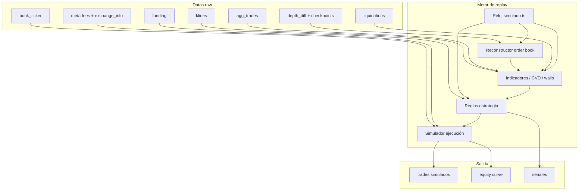

# Arquitectura de ingesta y almacenamiento de datos de mercado

> Documento de referencia para recopilar datos de Binance (USDM Futures y Spot)
> con fines de backtest. Describe **dos arquitecturas**, el catálogo de datos por
> tier, fuentes de ingesta, esquemas y convenciones de replay.

---

## 0. Objetivo

Guardar **raw data** (no indicadores precomputados) de forma reproducible para:

1. Simular bots con la misma lógica que en live/paper.
2. Reconstruir order books, CVD, funding, etc. en el replay.
3. Comparar estrategias sobre períodos largos sin depender de proveedores externos.

**Principio:** calcular indicadores (ADX, ATR, CVD, walls, imbalance) en el backtest
a partir de datos crudos. Solo persistir derivados si el cálculo es muy costoso y
están versionados.

---

## 1. Las dos arquitecturas

### 1.1 Arquitectura A — Simple (recomendada para empezar)

```
[Binance REST/WS]
        │
        ▼
[Node.js Ingestor]  ──►  buffer RAM  ──►  flush batch
        │
        ▼
[Parquet particionado]  (disco local / NAS)
        │
        ▼
[DuckDB / Polars / scripts de backtest]
```

| Componente | Rol |
|---|---|
| **Ingestor Node.js** | Suscripciones WS + polling REST; normaliza timestamps UTC ms |
| **Buffer + flush** | Acumula filas; escribe cada 1–5 min o N filas (10k–100k) |
| **Parquet** | Almacén frío columnar, comprimido (zstd) |
| **DuckDB** | SQL sobre Parquet para exploración y export a backtest |

**Cuándo usarla**

- 1–10 símbolos, 1–3 desarrolladores.
- Objetivo principal: backtest offline.
- Un solo consumidor de datos (el simulador).
- Disco NVMe ≥ 500 GB según profundidad y retención.

**Ventajas:** mínima ops, barata, fácil de depurar, portable.

**Limitaciones:** si el writer cae durante flush pierdes el buffer RAM; un solo
proceso consumidor; queries concurrentes limitadas vs ClickHouse.

---

### 1.2 Arquitectura B — Escala (streaming + OLAP)

```
[Binance REST/WS]
        │
        ▼
[Node.js Ingestor]  ──►  [Redpanda / Kafka]  ──►  [Consumer Escritor]
        │                         │                        │
        │                         │                        ▼
        │                         │                 [ClickHouse]
        │                         │
        │                         └──►  [Consumer Parquet] (archivo frío, opcional)
        │
        └── health / metrics
```

| Componente | Rol |
|---|---|
| **Ingestor** | Publica eventos normalizados a topics; no escribe disco |
| **Redpanda/Kafka** | Buffer duradero; desacopla ingesta de persistencia; replay |
| **Escritor → ClickHouse** | Batch insert cada 5–30 s; consultas analíticas SQL |
| **Escritor → Parquet** (opcional) | Mismo stream; backup y backtest offline sin depender de CH |

**Cuándo usarla**

- 10+ símbolos, 24/7, varios consumidores (backtest, dashboards, alertas).
- Depth @100ms + agg trades en muchos pares.
- Equipo con capacidad de operar clusters.

**Ventajas:** no pierdes eventos si ClickHouse cae; replay del bus; agregaciones rápidas.

**Limitaciones:** RAM/CPU, monitoring, particiones, consumer lag, backups.

---

### 1.3 Comparación rápida

| Criterio | Arquitectura A (Parquet) | Arquitectura B (Redpanda + CH) |
|---|---|---|
| Complejidad ops | Baja | Alta |
| Costo inicial | Bajo | Medio–alto |
| Símbolos típicos | 1–10 | 10–100+ |
| Depth @100ms | Sí (diffs) | Sí (ideal) |
| Replay backtest | Leer Parquet | Export CH → Parquet o query directa |
| Pérdida ante crash | Buffer RAM (minutos) | Casi ninguna (log en broker) |
| Stack sugerido | Node + Parquet + DuckDB | Node + Redpanda + CH + Parquet |

**Recomendación:** empezar con **A**; migrar a **B** cuando el volumen, los
consumidores o la tolerancia a pérdida de datos lo exijan. En **B**, mantener siempre
un consumer que escriba **Parquet** como archivo frío para backtest reproducible.

---

## 2. Convenciones comunes (ambas arquitecturas)

### 2.1 Timestamps

- Guardar **`ts` en UTC, int64 milisegundos** (event time del exchange).
- Opcional: `received_at` (hora de llegada al ingestor) para medir latencia.
- Nunca mezclar timezones en un mismo dataset.

### 2.2 Particionado en disco (Arquitectura A)

```
data/
  {dataset}/
    symbol=ETHUSDT/
      date=2026-07-09/
        hour=14.parquet    # o un solo data.parquet por día
  meta/
    exchange_info/
    fees/
    catalog.json           # índice de qué días/símbolos existen
  gaps/
    {dataset}_{symbol}.jsonl  # huecos detectados
```

### 2.3 Topics Kafka (Arquitectura B)

Un topic por **tipo de dato**, no un mega-topic:

```
market.klines.{interval}     # o market.klines con campo interval
market.agg_trades
market.book_ticker
market.depth_diff
market.mark_price
market.liquidations
market.funding
market.open_interest
market.exchange_info
meta.fees
```

Particionar por **`symbol`** para preservar orden por par.

### 2.4 Esquemas ClickHouse (Arquitectura B)

Patrón general:

```sql
ENGINE = MergeTree()
PARTITION BY (symbol, toYYYYMM(ts))
ORDER BY (symbol, ts, <id_desempate>)
TTL ts + INTERVAL 12 MONTH   -- opcional, p.ej. solo para depth
```

Insertar en **batch** (10k–100k filas). Evitar insert fila a fila.

### 2.5 Catálogo y calidad

Cada ingestor debe registrar:

- `first_ts`, `last_ts` por archivo/partición
- Conteo de eventos
- Gaps (WS desconectado > N segundos)
- Checksum o `row_count` por archivo

Archivo `meta/catalog.json` actualizado en cada flush.

### 2.6 Retención sugerida

| Dataset | Retención fría | Nota |
|---|---|---|
| OHLCV, funding, agg trades | Indefinida | Peso bajo |
| book_ticker, mark_price | 1–2 años | Moderado |
| depth_diff @100ms | 6–12 meses | El más pesado |
| liquidations | Indefinida | Eventos discretos, poco peso |
| OI | 1–2 años | Moderado |

---

## 3. Fuentes Binance (referencia)

Exchange principal asumido: **Binance USDM Futures** (`fstream.binance.com`).
Spot cuando se indique (`api.binance.com` / `stream.binance.com`).

| Dato | Fuente live | Histórico REST |
|---|---|---|
| OHLCV | WS `kline_{interval}` o REST backfill | `GET /fapi/v1/klines` |
| Agg trades | WS `aggTrade` | `GET /fapi/v1/aggTrades` |
| bookTicker | WS `bookTicker` | No histórico → grabar live |
| mark price | WS `markPrice@1s` | No histórico → grabar live |
| Depth L2 diff | WS `{symbol}@depth@100ms` | No histórico → grabar live |
| Liquidaciones | WS `!forceOrder@arr` | No histórico → grabar live |
| Funding | REST poll | `GET /fapi/v1/fundingRate` |
| Open interest | REST poll | `GET /fapi/v1/openInterest` + histórico limitado |
| Exchange info | REST al inicio + diario | `GET /fapi/v1/exchangeInfo` |
| Index price | WS `markPrice` incluye index | Grabar live |
| Spot OHLCV | WS / REST spot | `GET /api/v3/klines` |

**Backfill:** al arrancar, descargar histórico REST disponible (klines, funding,
agg trades en ventanas) y luego conectar WS para tiempo real.

---

## 4. Catálogo de ingesta por tier

Para cada dato se indica: qué guardar, resolución, fuente, ingesta en **A** y **B**,
esquema mínimo y uso en backtest.

---

### Tier 1 — Casi todo bot lo necesita

#### 4.1 OHLCV (velas)

| Campo | Descripción |
|---|---|
| `open_time`, `close_time` | ms UTC |
| `open`, `high`, `low`, `close`, `volume` | float |
| `quote_volume`, `trades_count` | opcional |
| `symbol`, `interval` | `1m`, `5m`, `15m`, `1h`, `4h`, `1d` |

**Resolución:** intervalos que use el bot (mínimo `1m` para intrabar; señales en `1h`, etc.).

**Ingesta A**

1. Backfill REST: paginar `klines` por rango de fechas al iniciar.
2. WS `kline_{interval}`: guardar solo vela **cerrada** (`x: true`).
3. Flush diario → `data/klines/symbol=ETHUSDT/interval=1h/date=.../data.parquet`.

**Ingesta B**

- WS → topic `market.klines` → CH tabla `klines` o consumer Parquet.
- Job nocturno de reconciliación REST vs CH (rellenar gaps).

**Esquema Parquet / CH**

```
symbol, interval, open_time, close_time, open, high, low, close, volume, trades_count
```

**Backtest:** alimentar indicadores; evaluar señales al `close_time`; stops intrabar
con `high`/`low` de velas de resolución menor.

---

#### 4.2 Last / mark price

| Campo | Descripción |
|---|---|
| `ts` | ms |
| `last_price` | último trade (de aggTrade o mini ticker) |
| `mark_price` | futuros: mark para PnL y liquidaciones |
| `index_price` | opcional, mismo stream markPrice |

**Resolución:** tick (aggTrade) + mark cada **1s** (`markPrice@1s`).

**Ingesta A**

- WS `aggTrade` → actualiza last (o derivar de agg_trades).
- WS `markPrice@1s` → fila por segundo.
- Alternativa ligera: solo `bookTicker` mid si no necesitas mark tick a tick.

**Ingesta B**

- Topics `market.agg_trades` + `market.mark_price`.
- CH: tabla `mark_price` (1 fila/s) + last derivable de agg_trades.

**Esquema**

```
ts, symbol, mark_price, index_price, last_price
```

**Backtest:** PnL unrealized, simulación de liquidación, fallback de precio si no hay bookTicker.

---

#### 4.3 Trades públicos (agg)

| Campo | Descripción |
|---|---|
| `ts`, `trade_id`, `price`, `qty`, `is_buyer_maker` | |
| `symbol` | |

**Resolución:** tick (cada aggTrade).

**Ingesta A**

- WS `aggTrade` → buffer → Parquet horario/diario.
- Backfill REST `aggTrades` (ventanas de 1h, rate limit).

**Ingesta B**

- Topic `market.agg_trades` → CH `agg_trades` (partición mensual).

**Esquema**

```
ts, symbol, trade_id, price, qty, is_buyer_maker
```

**Backtest:** CVD, delta, VWAP, confirmación bounce (`BOUNCE_CONFIRM_CVD`), volumen buy/sell.

---

#### 4.4 Spread bid/ask (bookTicker)

| Campo | Descripción |
|---|---|
| `ts`, `bid`, `ask`, `bid_qty`, `ask_qty` | best nivel |
| `mid` | derivable: `(bid+ask)/2` |

**Resolución:** tick (cada cambio en bookTicker; muy frecuente).

**Ingesta A**

- WS `bookTicker` → escribir cada evento o **sample 100ms** si el volumen es excesivo.
- Dedup: no escribir si bid/ask no cambió.

**Ingesta B**

- Topic `market.book_ticker` → CH o Parquet.

**Esquema**

```
ts, symbol, bid, ask, bid_qty, ask_qty
```

**Backtest:** fills MARKET (long @ ask, short @ bid), slippage, `PaperExecutor.tick()`.

---

#### 4.5 Fees

| Campo | Descripción |
|---|---|
| `effective_from`, `maker`, `taker`, `tier`, `source` | |

**Resolución:** estático; actualizar cuando cambie tu tier VIP o promoción.

**Ingesta A / B**

- Archivo `meta/fees.json` versionado por fecha.
- No requiere WS; actualización manual o poll de endpoint de comisión si existe.

**Backtest:** aplicar maker/taker según tipo de orden simulada y fecha del trade.

---

#### 4.6 Instrument meta (exchange info)

| Campo | Descripción |
|---|---|
| `symbol`, `tick_size`, `step_size`, `min_qty`, `min_notional` | |
| `contract_type`, `status`, `onboard_date` | |
| `snapshot_ts` | cuándo se leyó |

**Resolución:** al inicio + poll diario (detectar cambios de precisión).

**Ingesta A / B**

- REST `exchangeInfo` filtrado por símbolos activos → `meta/exchange_info/{symbol}.json`.
- Append historial si `tickSize` cambia (raro).

**Backtest:** `roundStep`, `floorStep`, validación de sizing idéntica al bot live.

---

### Tier 2 — Bots intermedios / avanzados

#### 4.7 Order book L2 (depth)

**Qué guardar (recomendado): diffs incrementales**, no fotos completas cada 100ms.

| Campo | Descripción |
|---|---|
| `ts`, `U`, `u`, `pu` | IDs secuencia Binance |
| `bids`, `asks` | arrays `[price, qty]` solo niveles **modificados** |
| `symbol` | |

Además:

- **Checkpoints:** snapshot REST `GET /fapi/v1/depth?limit=1000` cada 1–6 h.
- **bookTicker** (Tier 1) para `currentPrice` al reconstruir walls.

**Resolución:** `@depth@100ms` (batches de diffs cada ≤100ms).

**Ingesta A**

1. WS `depth@100ms` → normalizar → buffer → Parquet.
2. Timer: checkpoint REST + guardar `lastUpdateId`.
3. Recorte opcional al persistir: descartar niveles a >1.5% del mid (reduce disco;
   no afecta `getWalls` con buckets de $10 cerca del precio).

**Ingesta B**

- Topic `market.depth_diff` (alto throughput) → CH tabla `depth_diff` o consumer Parquet dedicado.
- Topic `market.depth_checkpoint` (bajo volumen).

**Replay (igual que `src/bot/orderbook.ts`)**

```
1. Cargar checkpoint (bids/asks Map)
2. Aplicar diffs en orden (validar pu == lastU)
3. Actualizar mid desde bookTicker
4. Llamar getWalls(bucketSize, topN) en los instantes del bot
   (p.ej. cada 10s bounce, fases straddle/build ladder)
```

**Estimación disco (1 símbolo, ETH, diffs @100ms, comprimido):** ~150–350 MB/día.

**Esquema diff**

```
ts, symbol, U, u, pu, bid_prices[], bid_qtys[], ask_prices[], ask_qtys[]
```

**Esquema checkpoint**

```
ts, symbol, last_update_id, bid_prices[], bid_qtys[], ask_prices[], ask_qtys[]
```

---

#### 4.8 Funding rate (perps)

| Campo | Descripción |
|---|---|
| `funding_time`, `funding_rate` | cada 8h |
| `mark_price` | opcional en el mismo evento |
| `symbol` | |

**Resolución:** cada 8h; poll REST cada 1–5 min para capturar el cierre.

**Ingesta A**

- Backfill: `GET /fapi/v1/fundingRate` histórico completo.
- Poll: `GET /fapi/v1/premiumIndex` o funding rate actual → append si cambió.

**Ingesta B**

- Topic `market.funding` → CH `funding_rates`.

**Backtest:** APR (`rate * 3 * 365`), gates de entrada/salida funding, coste de hold en momentum/funding.

---

#### 4.9 Open interest

| Campo | Descripción |
|---|---|
| `ts`, `open_interest`, `symbol` | |

**Resolución:** poll cada **5m** (`GET /fapi/v1/openInterest`); histórico vía
`GET /futures/data/openInterestHist` (intervalo 5m, 15m, 1h).

**Ingesta A / B**

- Cron cada 5m + backfill histórico al arrancar.

**Backtest:** filtros de régimen, confirmación de tendencia (no señal primaria en la mayoría de bots).

---

#### 4.10 Liquidaciones forzadas

| Campo | Descripción |
|---|---|
| `ts`, `side`, `price`, `qty`, `symbol` | |
| `notional` | derivable `price * qty` |

**Resolución:** evento (WS `!forceOrder@arr`).

**Ingesta A / B**

- WS global liquidations → filtrar por símbolos suscritos → Parquet / topic `market.liquidations`.

**Backtest:** LiqRev cascade detector, análisis de squeeze; ventanas rodantes de notional.

---

#### 4.11 Volumen buy/sell por vela

**Derivable** desde agg trades (agrupar por intervalo). No guardar salvo optimización.

Si se persiste pre-agregado:

```
interval, open_time, buy_volume, sell_volume, delta
```

Job batch cada hora sobre agg_trades → `derived/volume_delta/`.

---

#### 4.12 Volatilidad realizada

**Derivable** desde OHLCV. Opcional guardar en `derived/realized_vol/` si se consulta mucho.

---

### Tier 3 — Bots específicos / multi-mercado

#### 4.13 Spot price (mismo activo)

| Campo | `ts`, `mid` o OHLCV spot |
|---|---|

**Fuente:** Spot WS `bookTicker` o klines `GET /api/v3/klines`.

**Ingesta:** proceso paralelo o mismo ingestor con `market=spot` en path/topic.

**Backtest:** basis, estrategia funding delta-neutral.

---

#### 4.14 Index price

Incluido en stream `markPrice@1s` (`indexPrice`). Persistir junto a mark (§4.2).

---

#### 4.15 Basis / premium

**Derivable:** `perp_mid - spot_mid` o `perp - index`. Calcular en replay o job batch → `derived/basis/`.

---

#### 4.16 Order book imbalance

**Derivable** al reconstruir L2:

```
imbalance = (sum_bid_topN - sum_ask_topN) / (sum_bid_topN + sum_ask_topN)
```

Guardar solo si el backtest lo necesita a alta frecuencia y quieres evitar recomputar.

---

#### 4.17 Depth delta / book updates

Equivalente a §4.7 (`depth_diff`). Es la forma nativa de Binance @100ms.

---

#### 4.18 L3 / order events

Binance USDM **no expone L3 público** con order IDs. Solo L2 agregado + diffs.
Para L3 real: proveedor pago (Tardis, Amberdata) o aceptar pseudo-L2.

**No incluir en ingesta Binance nativa** salvo migración a proveedor externo.

---

#### 4.19 Multi-exchange prices

Topic/path por exchange: `data/binance/...`, `data/bybit/...`. Mismo esquema bookTicker/klines.

---

#### 4.20 On-chain (opcional)

Fuente externa (Glassnode, Dune, etc.). Fuera del scope Binance; CSV/Parquet en `data/onchain/`.

---

### Tier 4 — Contexto y régimen

Estos datos son **ligeros** y mayormente REST o derivados.

| Dato | Ingesta | Frecuencia |
|---|---|---|
| BTC dominance | REST CoinGecko / derivar de klines BTC vs TOTAL | 1h–1d |
| Volumen 24h del par | `GET /fapi/v1/ticker/24hr` | 5–15 min |
| Realized vol / ATR histórico | Derivar de OHLCV | batch diario |
| Calendario funding | Tabla estática 8h UTC | una vez |
| Sesiones (Asia/EU/US) | Config / no ingesta | estático |
| Eventos macro | CSV manual `meta/macro_events.csv` | manual |

---

## 5. Mapa de suscripciones WS (ingestor único)

Un solo proceso Node puede multiplexar:

```
Combined stream USDM:
  {symbol}@aggTrade
  {symbol}@bookTicker
  {symbol}@markPrice@1s
  {symbol}@depth@100ms
  {symbol}@kline_1m
  {symbol}@kline_1h          # repetir por cada interval necesario
!forceOrder@arr              # liquidaciones (filtrar symbol)
```

Polling REST (timers):

```
cada 5m:   openInterest, ticker/24hr
cada 1m:   premiumIndex / funding
cada 24h:  exchangeInfo
backfill:  klines, fundingRate, aggTrades (al arrancar)
```

**Límite:** respetar rate limits REST; usar peso de endpoints Binance; backoff exponencial.

---

## 6. Flujo de ingesta detallado

### 6.1 Arquitectura A — pseudocódigo

```text
onStartup():
  backfillKlines(symbols, intervals, fromDate)
  backfillFunding(symbols)
  backfillAggTrades(symbols, last7days)  # opcional
  loadExchangeInfo(symbols)
  connectWebSockets(symbols)

onWsEvent(type, payload):
  row = normalize(type, payload)
  buffer[type].push(row)
  if buffer[type].length >= FLUSH_ROWS or elapsed >= FLUSH_MS:
    writeParquet(type, buffer[type])
    buffer[type] = []

onCheckpointTimer(6h):
  for symbol in symbols:
    saveDepthCheckpoint(symbol)
    updateCatalog()
```

**Formato de escritura:** Parquet con compresión `zstd`; archivos 50–500 MB comprimidos.

### 6.2 Arquitectura B — pseudocódigo

```text
onWsEvent(type, payload):
  row = normalize(type, payload)
  kafka.produce(`market.${type}`, key=symbol, value=row)

// Consumer group: clickhouse-writer
onBatch(messages):
  rows = parse(messages)
  clickhouse.insert(tableFor(type), rows)

// Consumer group: parquet-archiver (opcional)
onBatch(messages):
  writeParquet(type, rows)
```

**Retención Kafka:** 24–72 h (histórico largo en CH/Parquet, no en el bus).

---

## 7. Modelo de replay para backtest



**Orden de eventos en replay:** merge por `ts` de todas las fuentes tick-level;
velas cerradas en `close_time`; funding en `funding_time` exacto.

**Ejecución simulada:**

| Tipo orden | Precio fill |
|---|---|
| MARKET long | ask (+ slippage) |
| MARKET short | bid (− slippage) |
| LIMIT long | limit si `low <= limit` en barra |
| STOP | trigger + slippage |

---

## 8. Prioridad de implementación

| Fase | Datasets | Motivo |
|---|---|---|
| **1** | klines, funding, book_ticker, meta | Momentum, funding, fills paper |
| **2** | agg_trades, liquidations | CVD, LiqRev |
| **3** | depth_diff + checkpoints | Bounce, ladder |
| **4** | OI, spot, 24h volume | Contexto / funding completo |
| **5** | Tier 3–4 según necesidad | Multi-mercado, régimen |

---

## 9. Estimación de disco (orientativa, 1 símbolo ETHUSDT)

| Dataset | Comprimido / día |
|---|---|
| klines 1m + 1h | ~1–3 MB |
| agg_trades | ~50–200 MB |
| book_ticker (dedup) | ~20–80 MB |
| mark_price 1s | ~5–15 MB |
| depth_diff @100ms | ~150–350 MB |
| liquidations | ~1–10 MB |
| funding + OI | < 1 MB |
| **Total fase 1–3** | **~250–650 MB/día** |
| **1 año** | **~90–240 GB** |

Spot + más intervalos + sin dedup → más.

---

## 10. Checklist operativo

- [ ] Timestamps UTC ms en todos los datasets
- [ ] Partición `symbol/date` (y `interval` en klines)
- [ ] `meta/catalog.json` con cobertura temporal
- [ ] Log de gaps cuando WS cae > 30s
- [ ] Checkpoints depth cada ≤6 h
- [ ] Backfill REST al arrancar antes de confiar en WS
- [ ] Config del bot (`bucketSize`, fees, precision) versionada por run de backtest
- [ ] Indicadores calculados en replay, no duplicados en ingesta
- [ ] Retención/TTL definida por dataset
- [ ] Arq. B: consumer lag alarm + batch insert CH

---

## 11. Relación con este repositorio

El bot actual ya implementa reconstrucción L2 en `src/bot/orderbook.ts`:

- WS `@depth@100ms` + snapshot REST `limit=1000`
- Precio: `bookTicker` mid (+ fallback `markPrice`)
- Walls: `getWalls(BUCKET_SIZE, WALLS_TO_KEEP)`

Para backtest fiel de bounce/ladder, la ingesta de **depth_diff + book_ticker +
checkpoints** debe permitir reproducir ese mismo pipeline. Bounce muestrea walls
cada `BOUNCE_SAMPLE_INTERVAL_SEC` (default 10s); el replay debe llamar `getWalls()`
en esos instantes, no necesariamente cada 100ms.

---

## 12. Referencias

- [Binance Futures WebSocket Market Streams](https://binance-docs.github.io/apidocs/futures/en/#websocket-market-streams)
- [Binance Futures REST API](https://binance-docs.github.io/apidocs/futures/en/#public-rest-api)
- Documentación interna: `docs/estrategias-plan-implementacion.md`
- Order book del bot: `src/bot/orderbook.ts`
